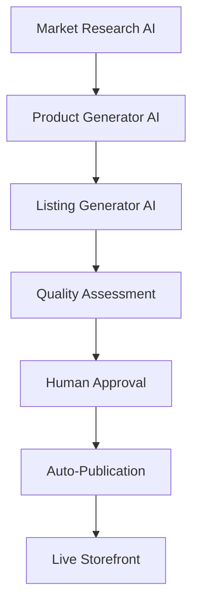

# 🚀 Alora Platform

**AI-Powered Product Generation & E-commerce Platform**

[](LICENSE)
[](https://python.org)
[](https://nodejs.org)

Alora is a revolutionary AI-powered e-commerce platform that automatically generates, validates, and publishes high-quality digital products. Our AI pipeline analyzes market trends, creates products, and handles the entire journey from idea to storefront with minimal human intervention.

## 🏗️ Architecture Overview



### Core Services
- **Core API**: Central gateway and plugin orchestrator (FastAPI)
- **Storefront**: Customer-facing marketplace (Next.js)
- **Admin Dashboard**: Management interface with AI approval workflows (Next.js)
- **AI Services**: Market research, product generation, listing optimization
- **Plugin System**: Extensible product types (digital downloads, software tools, etc.)

## ✨ Key Features

### 🤖 AI-Driven Pipeline
- **Automated market research** and trend analysis
- **AI product generation** with quality feedback loops
- **SEO-optimized listings** with automated descriptions
- **Human-in-the-loop approval** for quality control

### 🛍️ E-commerce Platform
- **Modern storefront** with responsive design and themes
- **Comprehensive admin dashboard** for management
- **Secure payment processing** via PayPal/Stripe
- **Automated order fulfillment** for digital products

### 🔧 Plugin Architecture
- **🎉 7 Production-Ready Product Types**: All plugins fully standardized and tested
- **Extensible product types** via plugin system with standard interfaces
- **Custom validation** and fulfillment logic per type
- **JSONSchema enforcement** for data integrity
- **100% Core API compatibility** verified through integration tests

#### Available Product Types
| Plugin | Status | Description |
|--------|--------|-------------|
| digital-download | ✅ Production Ready | PDFs, documents, media files |
| ai-generated-content | ✅ Production Ready | AI-created guides, ebooks, templates |
| code-snippets | ✅ Production Ready | Code libraries, frameworks, utilities |
| content-products | ✅ Production Ready | Courses, tutorials, certifications |
| creative-assets | ✅ Production Ready | Logos, icons, graphics, designs |
| data-products | ✅ Production Ready | Datasets, spreadsheets, research |
| software-tools | ✅ Production Ready | Applications, utilities, scripts |

## 🚀 Quick Start

### Prerequisites
- Docker and Docker Compose
- Node.js 18+ (for local frontend development)
- Python 3.11+ (for local API development)

### Setup
```bash
# Clone repository
git clone https://github.com/jamesbray03/alora-platform.git
cd alora-platform

# Copy and configure environment
cp env.template .env
# Edit .env with your API keys and settings

# Start development environment
docker-compose up -d

# Access the services
# Storefront: http://localhost:3000
# Core API: http://localhost:8000
# Admin Dashboard: http://localhost:3001
```

## 📁 Repository Structure

```
alora-platform/
├── .dev/                 # 🎯 AI-optimized developer docs (START HERE)
├── core-api/             # Central API gateway (FastAPI)
├── storefront/           # Customer marketplace (Next.js)
├── admin-dashboard/      # Management interface (Next.js)
├── services/             # AI microservices
│   ├── market-research/  # Market analysis
│   └── product-generator/ # AI product creation
├── product_types/        # Plugin system for product types
├── shared/               # Common utilities and contracts
└── infrastructure/       # Deployment configurations
```

## 🎯 For Developers

### 📚 Start Here for Development
1. **Read**: [`.dev/README.md`](.dev/README.md) - Foundation and navigation
2. **Navigate**: [`.dev/prompts/INDEX.md`](.dev/prompts/INDEX.md) - Find your work area
3. **Setup**: [`.dev/workflows/development.md`](.dev/workflows/development.md) - Local environment

### 🔗 Quick Links
- **Architecture**: [`.dev/architecture/overview.md`](.dev/architecture/overview.md)
- **Security**: [`.dev/architecture/security.md`](.dev/architecture/security.md)
- **Contributing**: [`CONTRIBUTING.md`](CONTRIBUTING.md)

## 🛠️ Technology Stack

- **Backend**: Python (FastAPI), PostgreSQL, Redis
- **Frontend**: Next.js, React, TypeScript, Tailwind CSS
- **AI/ML**: OpenAI GPT-4, Anthropic Claude
- **Infrastructure**: Docker, Kubernetes
- **Storage**: S3-compatible (MinIO for dev)

## 🔒 Security & Compliance

- **Payment security** via provider offloading (no card data storage)
- **Webhook verification** for all payment callbacks
- **Input validation** with JSONSchema enforcement
- **RBAC** for admin operations
- **Audit logging** for administrative actions

## � Monitoring & Analytics

- **Real-time dashboard** with sales and AI metrics
- **Quality scoring** for AI-generated content
- **Performance monitoring** across all services
- **A/B testing** for product optimization

## 🚀 Deployment

- **Development**: Docker Compose with hot-reload
- **Production**: Kubernetes with auto-scaling
- **CI/CD**: GitHub Actions with automated testing
- **Monitoring**: Prometheus + Grafana stack

## 📄 License

This project is licensed under the MIT License - see the [LICENSE](LICENSE) file for details.

---

**Ready to develop?** Start with [`.dev/README.md`](.dev/README.md) for AI-optimized context and navigation.

### 1. Clone and Setup
```bash
git clone <repository-url>
cd Alora
```

### 2. Start with Docker Compose
```bash
# Start all services (recommended)
docker-compose up --build

# Or start individual services
docker-compose up postgres redis minio  # Infrastructure only
```

### 3. Access the Platform
- **Storefront**: http://localhost:3000
- **Admin Dashboard**: http://localhost:3000/admin/dashboard  
- **Core API**: http://localhost:8000
- **API Docs**: http://localhost:8000/docs

### 4. Health Check URLs
- Core API: http://localhost:8000/health
- Database: http://localhost:8000/health/database
- Plugins: http://localhost:8000/plugins

## 🛠️ Development

### Local Development Setup

#### Core API (Python/FastAPI)
```bash
cd core-api
python -m venv venv
source venv/bin/activate  # Windows: venv\Scripts\activate
pip install -r requirements.txt
uvicorn app.main:app --reload --port 8000
```

#### Storefront (Next.js)
```bash
cd storefront
npm install
npm run dev  # Starts on http://localhost:3000
```

### Environment Variables
Copy `.env.example` to `.env` and configure:
- `DATABASE_URL`: PostgreSQL connection string
- `REDIS_URL`: Redis connection for background tasks
- `MINIO_*`: S3-compatible storage for file uploads
- `PAYPAL_*`: Payment provider credentials

## 📦 Project Structure

```
.
├── core-api/           # FastAPI backend
│   ├── app/
│   │   ├── routers_*   # API endpoints
│   │   ├── models.py   # Database models
│   │   ├── plugins.py  # Plugin system
│   │   └── ...
│   └── requirements.txt
├── storefront/         # Next.js frontend
│   ├── app/
│   │   ├── components/ # Reusable UI components
│   │   ├── admin/      # Admin dashboard
│   │   └── ...
│   └── package.json
├── product_types/      # Product plugins
│   └── digital-download/
│       ├── manifest.yaml
│       ├── validate.py
│       ├── to_listing.py
│       └── fulfill.py
├── INITIAL_PROMPTS/    # Development documentation
└── docker-compose.yml
```

## 🔌 Plugin System

Add new product types by creating a plugin in `product_types/<type-id>/`:

1. **manifest.yaml**: Product type definition and schema
2. **validate.py**: Input validation logic
3. **to_listing.py**: Convert product data to storefront listing
4. **fulfill.py**: Handle order fulfillment

See `INITIAL_PROMPTS/INDEXED/product-plugin-template.md` for details.

## 🔐 Admin Access

Create an admin user:
```bash
cd core-api
python create_admin.py
```

Then access the admin dashboard at `/admin/dashboard`.

## 📋 Commands Reference

### Docker Commands
```bash
# Start all services
docker-compose up

# Rebuild and start
docker-compose up --build

# Stop services  
docker-compose down

# View logs
docker-compose logs core-api
docker-compose logs storefront
```

### Python Service Commands
```bash
# Run tests
pytest

# Format code
black .
isort .

# Lint
flake8 .
```

### Frontend Commands
```bash
# Development server
npm run dev

# Build for production
npm run build

# Type checking
npm run type-check
```

## 📖 Documentation

Detailed documentation available in `INITIAL_PROMPTS/`:
- `ALORA_TECHNICAL_ARCHITECTURE.md`: System architecture
- `ALORA_SETUP_GUIDE.md`: Detailed setup instructions  
- `INDEXED/`: Component-specific guides

## 🤝 Contributing

1. Follow the existing code style and patterns
2. Add tests for new features
3. Update documentation as needed
4. Ensure all health checks pass before submitting

## 📄 License

[Your License Here]